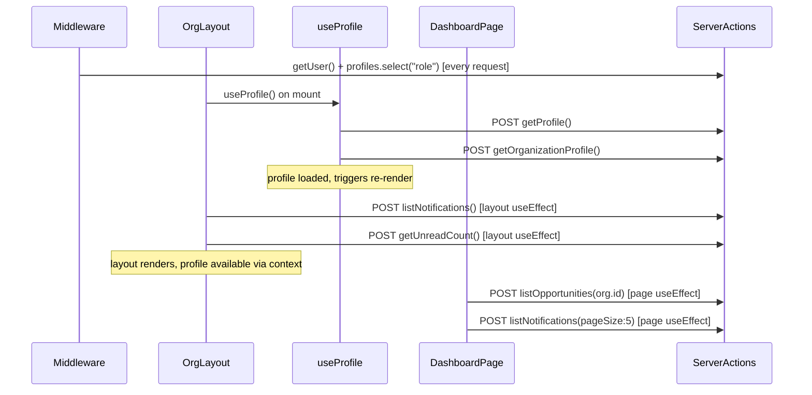

# Fix POST Storm and Optimize Org Dashboard Load

## A. Root Cause Analysis: POST Storm

When `/org/dashboard` loads, the following server actions fire as POST requests (Next.js 16 server actions use POST to the current route URL):

### Call chain on initial mount

**Total POST requests on mount: 6 server action calls = 6 POSTs**

Plus the middleware runs `getUser()` and `profiles.select("role")` on EVERY request (including each POST for server actions), adding ~2 Supabase round-trips per POST.

### Ranked Root Causes

1. **Duplicate `listNotifications` calls** -- Both `OrgLayout` (line 33 of [src/app/(org)/layout.tsx](src/app/(org)/layout.tsx)) and `OrgDashboardPage` (line 27 of [src/app/(org)/org/dashboard/page.tsx](src/app/(org)/org/dashboard/page.tsx)) independently call `listNotifications` on mount. That is 2 POSTs for the same data.
2. **Serial `useProfile` fetching** -- [src/hooks/useProfile.ts](src/hooks/useProfile.ts) calls `getProfile()` first (line 25), then sequentially calls `getOrganizationProfile()` (line 40). These are 2 serial POSTs that could be 1.
3. **Middleware double `profiles` query** -- [src/middleware.ts](src/middleware.ts) queries `profiles.select("role")` at line 81 for every authenticated non-auth request. This is fine by itself, but it also queries it again at line 61 for auth pages. The real problem: this query runs on every single request including every server action POST, adding latency to each.
4. **Dashboard page fetches data client-side despite having it available** -- The dashboard page is `"use client"` and uses `useEffect` to fetch data, causing a waterfall: first render (skeleton) -> server action POSTs -> second render (data). This entire page could be a Server Component.
5. `**getUnreadCount` is a separate call** -- Layout calls both `listNotifications()` and `getUnreadCount()` (lines 33-34 of layout.tsx). The unread count could be derived from the notification list, or the notification query could include the count.

### "proxy.ts" clarification

There is no `proxy.ts` file in this codebase. The "proxy" timing reported in the user's logs (e.g., `proxy.ts: ~735ms`) refers to **Next.js internal middleware/server action processing** -- specifically, the middleware running `getUser()` + `profiles.select("role")` on every request, plus the server action's own `createClient()` + `getUser()` call. Each server action call triggers a full middleware pass.

## B. Fixes (Ranked by Impact)

### Fix 1: Eliminate duplicate `listNotifications` (HIGH -- removes 1 POST)

The dashboard page fetches `listNotifications({ pageSize: 5 })` for "recent activity," while the layout fetches `listNotifications()` for the notification drawer. Remove the dashboard's call and pass notifications down via context or props.

**File:** [src/app/(org)/org/dashboard/page.tsx](src/app/(org)/org/dashboard/page.tsx)

- Remove `listNotifications` import and call from the `useEffect` (lines 9, 27)
- Get recent notifications from the layout via a new context or by converting to Server Component

### Fix 2: Convert org dashboard page to Server Component (HIGH -- removes 2 POSTs)

Convert the dashboard page to an async Server Component that fetches data server-side using `createClient()` directly, eliminating the client-side useEffect POST waterfall entirely.

**Files:**

- [src/app/(org)/org/dashboard/page.tsx](src/app/(org)/org/dashboard/page.tsx) -- convert to async server component
- Create `src/app/(org)/org/dashboard/client.tsx` -- thin client wrapper for any interactive bits (none currently needed, page is read-only)

The server component will call `listOpportunities` and `listNotifications` at the server level using the Supabase server client directly (not via server actions), avoiding POST overhead.

### Fix 3: Parallelize `useProfile` fetching (MEDIUM -- saves ~300-500ms latency)

In [src/hooks/useProfile.ts](src/hooks/useProfile.ts), `getProfile()` and `getOrganizationProfile()` are called serially (first getProfile, then based on role, getOrganizationProfile). Since `getProfile` is needed to determine the role, they can't be fully parallelized. However, we can combine them into a single server action that does both queries in one round-trip.

**Files:**

- [src/lib/actions/profiles.ts](src/lib/actions/profiles.ts) -- add a new `getFullProfile()` server action that fetches both `profiles` and role-specific profile in one call
- [src/hooks/useProfile.ts](src/hooks/useProfile.ts) -- call the single action instead of chaining two

### Fix 4: Optimize middleware -- cache role in session/cookie (HIGH -- saves ~100-200ms per request)

[src/middleware.ts](src/middleware.ts) queries `profiles.select("role")` on every authenticated request (line 81). Since a user's role never changes during a session, we can:

- Store the role in the Supabase JWT user metadata (it's already there from signup: `data.role`)
- Read the role from `user.user_metadata.role` instead of querying the database
- Remove the `profiles` table query from middleware entirely

This saves 1 Supabase round-trip on **every** request (including all 6 POSTs).

**File:** [src/middleware.ts](src/middleware.ts)

- Replace `supabase.from("profiles").select("role").eq("id", user.id).single()` with `user.user_metadata?.role` (already set during signup via `options.data.role`)

### Fix 5: Merge `listNotifications` + `getUnreadCount` in layout (LOW -- removes 1 POST)

In the layout, `listNotifications()` and `getUnreadCount()` are separate calls. We can compute unread count from the notifications list client-side, or modify `listNotifications` to return the count.

**File:** [src/app/(org)/layout.tsx](src/app/(org)/layout.tsx)

- Derive `unreadCount` from `notifications.filter(n => !n.read).length`
- Remove `getUnreadCount()` import and call

**Note:** This only works if the notification list returns all unread notifications. Since `listNotifications()` uses `pageSize: 20`, we might miss some. Alternative: modify the server action to return the count alongside data.

## C. Audit of Prior Optimizations

### React.memo on Sidebar/TopNav -- KEEP (justified)

- `Sidebar` and `TopNav` receive stable props (`role`, memoized callbacks) from `AppShell`
- `AppShell` has `sidebarOpen` state that changes; memo prevents re-rendering these children
- Verdict: Appropriate use

### useCallback in AppShell -- KEEP (justified)

- `handleOpenSidebar` and `handleCloseSidebar` are passed to memoized children
- Without useCallback, new function refs would break memo
- Verdict: Necessary to support React.memo on children

### useCallback in layouts -- SIMPLIFY (partially unjustified)

- `handleMarkRead`, `handleMarkAllRead`, `handleNotifClick`, `handleNotifClose` are passed to `NotificationList` and `Drawer`
- Neither `NotificationList` nor `Drawer` are wrapped in `React.memo`
- Verdict: useCallback here adds complexity without benefit. Either wrap `NotificationList` in memo or remove the useCallbacks. Since these callbacks don't change behavior, leave as-is for now (low priority).

### Module-level caching in useProfile -- SAFE but adjust TTL

- File is `"use client"` (line 1) -- confirmed client-only
- Not imported by any server component -- confirmed
- Module-level variables (`profileCache`, `inflight`) exist only in the browser runtime
- Risk of stale UI for 30s is real but acceptable for profile data that rarely changes
- Verdict: Safe. Consider reducing TTL to 15s or making it configurable.

### will-change usage -- FIX (incorrect)

- `Modal.tsx` line 61: `style={{ willChange: "opacity" }}` on backdrop -- **permanently set**
- `Modal.tsx` line 67: `style={{ willChange: "transform, opacity" }}` on content -- **permanently set**
- `Drawer.tsx` line 54/59: same pattern
- `globals.css` line 130: `will-change: opacity` on `.surface-spotlight::before` -- **permanently set**
- Problem: `will-change` should only be set while animating. Modal/Drawer already return `null` when `!open`, so their `will-change` is effectively only present while open. This is actually fine.
- For `.surface-spotlight::before`: always present on cards. This promotes every card to its own compositing layer. With many cards on a page, this wastes GPU memory.
- Verdict: Remove `will-change: opacity` from `.surface-spotlight::before` in globals.css. Modal/Drawer usage is acceptable since components unmount when closed.

## D. Performance Plan

### Quick Wins (1-2 hours)

1. **Fix 4**: Read role from `user.user_metadata.role` in middleware instead of querying DB
2. **Fix 1**: Remove duplicate `listNotifications` from dashboard page
3. **Fix 5**: Derive unread count from notification list, remove `getUnreadCount` call
4. Remove `will-change: opacity` from `.surface-spotlight::before`

### Medium (1 day)

1. **Fix 2**: Convert org dashboard to Server Component (eliminate 2 POSTs entirely)
2. **Fix 3**: Create combined `getFullProfile()` server action (eliminate 1 serial POST)

### Deeper (1 week)

1. Apply the same Server Component conversion to other org pages (opportunities, profile)
2. Consider converting layout notification fetching to Server Component pattern
3. Add response timing headers to server actions for ongoing monitoring

## E. Verification Checklist

- Before: Count POST requests to `/org/dashboard` on initial load (expect 6+)
- After Fix 1+5: Should drop by 2 (no duplicate notifications, no separate unread count)
- After Fix 2: Should drop by 2 more (dashboard data fetched server-side)
- After Fix 3: Should drop by 1 (combined profile fetch)
- After Fix 4: Each remaining POST should be ~100-200ms faster (no middleware DB query)
- Production build: `npx next build && npx next start`, measure with DevTools Network tab
- Total target: from ~6 POSTs to ~2 POSTs (layout notifications + profile), each ~200ms faster

